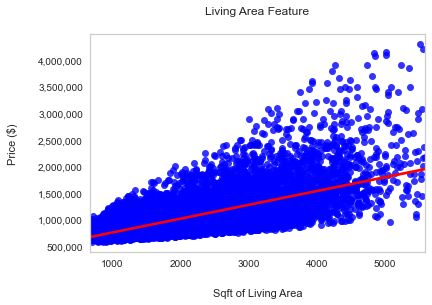
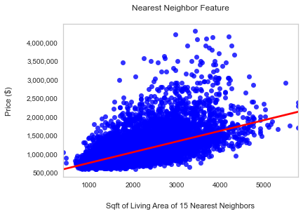
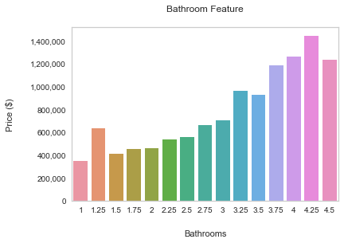
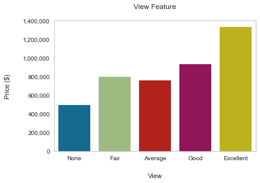
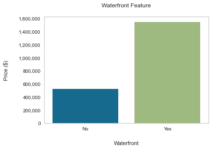

# Listing Price Predictor

Author: [Kyongmin](https://www.linkedin.com/in/kyongminso/), Meir, [Tyler](https://www.linkedin.com/in/tyler-wood-08a036216/)

## Overview

Using Multiple Linear Regression and other forms of statistical analysis, we used these practices to create a real estate price predictor for homes in King County. We created models that would show what factors can influence the housing prices in the county. These prediction models can be used to help any investors who are thinking about expanding on their real estate portfolio.

MKT LLC has a prominent presence in the real estate market in the greater Seattle area, we can provide a competitive edge through our housing price prediction model and can steer you in the right direction for growth and profit

---------------
## Business Problem 
With the increase in population, the real estate market is on the rise which means there is a potential for capitalization in this growing market and we believe that our model can provide an edge in the competitive market.

------------

## Understanding the numbers

All of our data came from a csv dataset that was provided for us from the county itself. The dataset contains thousands of detailed information of homes in the county ranging from square footage, bathrooms, bedrooms, and many other useful information. We had to dive into the data and do some data cleaning to make sure we were able to create our models. We were introduced to new tools, sklearn as well as use from the common tools we have used before:  pandas, numpy, seaborn, statsmodels, and matplotlib. All of these different tools were necessary in order for us to create a succesful model for this research. 

------
## Models 

When working on this project, we used two different types of modeling: predictive modeling and inferential modeling. 

## Simple Linear Regression 

### Heatmap

The 'sqft_living' variable had the highest correlation with price. This would be a great option for our first simple linear regression. The Pearson Correlation Coefficient of sq_ft living compared to price is .7. We can consider values .7 and above to be a significant linear correlation between two variables.

## Train-Test Split 

We performed a train-test split with:  y = target and x= housing features.  
We performed imputations to address the null values and properly scaled the data. We set up a dummy regressor to use as our first baseline comparison. Our first simple model outperformed the dummy regressor. For our train data, it gave us a value of .44 which means there is room for significant improvement. 

## Multiple Linear Regression 
Adding multiple feautures to our model allows us to more accurately predict the price. This adds complexity to the model, however, we have to be cautious that we aren't over complicating it. This allows us to determine the variance of the model as we progress through our iteration, as well as determing the relative contribution of each feature to the price. 

## Final Predictive Model

### mlr_9
After multiple iterations, we created our final predictive model which gave us a train R-Squared value of .854 and gave us an test R-Squared  of .859 which are similar, so it was neither over fit or underfit. Additionally, the RMSE 131,810 which is our lowest error of all the models showing that this was the most accurate model for predicitng y (housing price)

### Predictive Model

Our top predictive models uses the following features: 
- Sq.ft. living 
- Sq. ft. living 15 
- Bathrooms
- View 
- Waterfront 
- Zip Code 
- Quality 

We measured the success of our final model with these statistics: 

- Coefficient of Determination (R-Squared) =  .854
- Root Mean Squared Error = ~ $132,000

#### What does this mean?
---
- 85% of the variance in the dependent variable is explained by the independent variable in our model.
- Our prediction will on average be off about $132,000. 
 

We see when we plot predicted value vs. actual values the scatter plot clusters around the line of best fit, which has a slope of almost, nearly one. This tells us that our predicted values were close to our actual values. 

## Inferential Model

### mlr_10 (unscaled)
The purpose of Inferential Model is to find the relationship between the price and the features, and see how the relationship can affect their values. We chose mlr_10 unscaled as our inferential model. The inferential model uses the exact same features as our predictive model except that it is not scaled and we didn't use the log of the price. Although it provides lower R-squared values of .792 for our train, and .792 for test, we can still see that we are not overfitting or underfitting. The residuals show homoskedasticity, a normal curve, and qq plot that breaks one assumption. The Durbin Watson score is 1.96 which is close to 2, indicating minimal auto correlation. 

Our target variable was price and the graphs below show us the correlation between the different features and the target. 

The bigger your house is, the higher the price of the home will be. 

The bigger your neighbor's houses are, the price of the houses will increase. 

Looking at this graph, as the number of bathrooms increases, so does the price of the home. 

The better the view, the higher the price of the home will be. 

If you have a waterfront view home, it will most likely drive up the value of your home. 

# Conclusion 
## Recommendations 
-------

We recommend you explore these 3 points to consider for your benefit: 
1. Use our model to accurately price the current inventory.  
- The housing market is inefficient. Often, there are multiple bids for one ask.
- Houses are priced sometimes at an arbritrary matter due to emotion and sentimentality. 
- Our Model forgoes these drawbacks and provides data-backed pricing tool.
2. Use our model to find undervalued homes.
- When growing portfolio, it is cruxcial for new acuisition to be proftiibale. 
- Our model offers an accurate listing price, allowing the stakeholder to acquire undervalued properties which can be sold for a profit. 
3.  Use the model to find the best features to include in new home builds. 
- When growing the porfolio through constructing new homes, our model accurately depicts the impact that the above featuires will have on the price. 
- This steers the stakeholder into the proper direction. This allows the stakeholder to make better choices in regards to the house features, which they will include in the new builds. 

Overall, all the model building and data cleaning gave us the RMSE value of about $132,000. The model can be more precise with a lower RMSE, but the model is accurate in that it will predict the price within the range. 
Also, as seen by the qq plot, the linearity assumption is violated. With further data collection and research, the model can be improved. 
The focus should be on square foot living because we saw that, that was the highest correlated with the price. 

## For more information
---
To see more of this research, please view the [presentation](https://docs.google.com/presentation/d/1yD90aYa58sU7afved1218I4qQN6k-hgGJ7FpRrDJ0fU/edit#slide=id.g120e22c8c1b_2_20) for more information. 

## Sources
---
The links down below is where we got some of our information. 

- [GeekWire](https://www.geekwire.com/2021/census-data-shows-seattles-population-surge-last-decade-fueled-part-tech-job-growth/)

- [Seattle Times](https://www.seattletimes.com/seattle-news/data/surprise-seattle-was-the-fastest-growing-big-u-s-city-in-2020/)